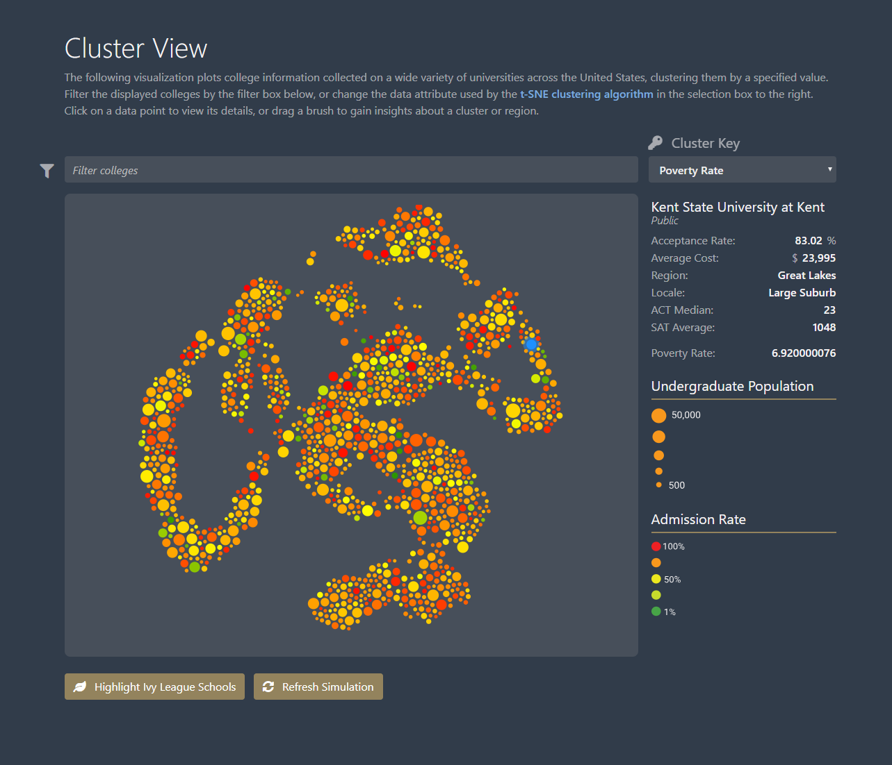
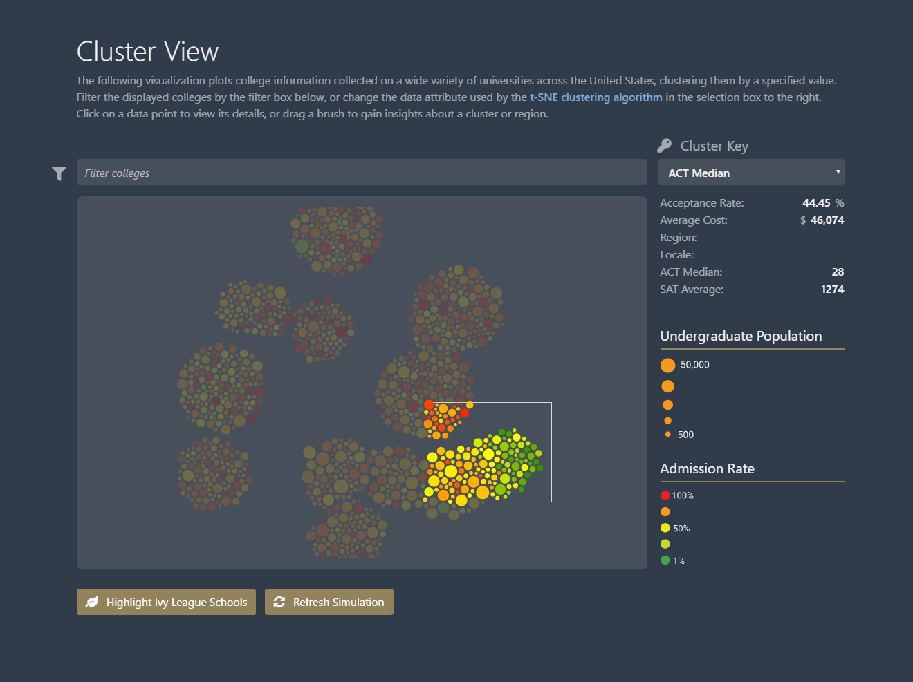
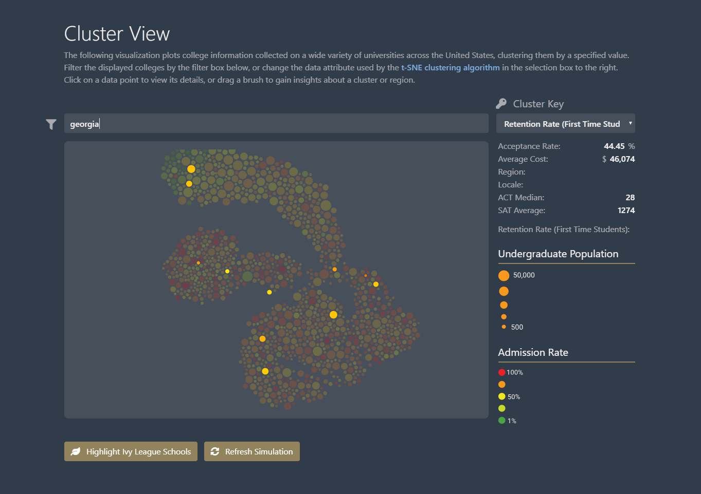
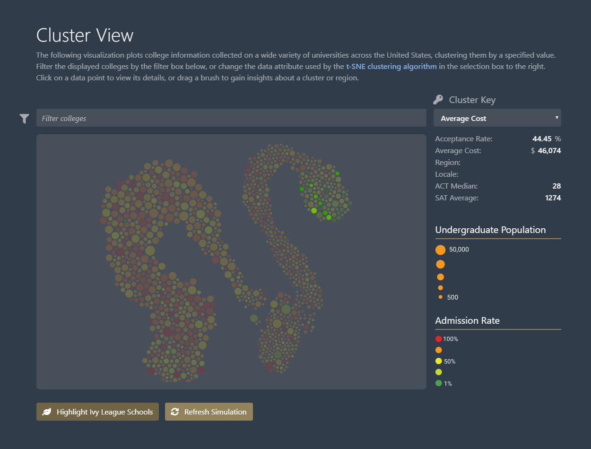

# College Explorer Design Docs

---

#### Team: Joseph Azevedo and Nichole Deeb

Dataset Chosen: `colleges.csv` [(link to data)](/projects/college-explorer/assets/colleges.csv)

## Supported Analytic Tasks

- Cluster colleges together that have similar values for a specific selected key
  - Rapidly analyze proximity or lack thereof between colleges based on population and acceptance rate
  - Easily change the selected key with a dropdown that instantly begins to regenerate the clusters for the new key
  - View the relationship that acceptance rate and undergraduate population has on the location of colleges in the clusters
- Use brushing to select a rectangular area and receive average information about the cluster
  - Select the entire data set and view average information about the sample as a whole
  - Shows averages of acceptance rate, average cost, ACT and SAT scores, and the selected key if it falls outside of these specifications (i.e. Poverty Rate if and only if it selected as the key)
- Live search filtering for specific colleges to see their location in the clusters (i.e. "Georgia" will highlight all colleges that have "Georgia" in their name)
- Highlight Ivy League colleges and see their locations in the clusters
- View data of a single data point, showing all relevant information as well as the selected key

## Design Overview

We focused our design mainly around the correlation of colleges' undergraduate population and admission rate (reflecting how "prestigious" the school is) versus a variety of different variables that we allowed the user to select themselves. With this selected variable, we utilized the [t-SNE library](https://lvdmaaten.github.io/tsne/) to simulate forces and enforce clustering, meaning that the points representing schools with similar values for these variables will tend to be closer together.

Overall, our design is intended to show relationships between colleges on a large-scale graph with over a thousand data points. We allowed individual searches to separate out specific colleges, but our design was generally more geared to large clusters of colleges. For instance, we wanted to allow the ability to glance at a cluster of ACT scores, and easily see that typically smaller colleges with lower admission rate (more green in color) were in clusters with higher ACT averages, and so forth.

---

## Screenshots of User Interface

  

## Additional Notes/UI Explanations

We wanted the first two characteristics, undergraduate population and admission rate, to always be visibile in the visualization, as they were our primary motivating factor. Because of this, we encoded their values in the data points themselves, deciding on the following encodings:

- **Undergraduate population** - represented as the size of each data mark (a visual cue to the real-life idea of university "size")
- **Admission rate** - represented as the color of each data mark, with red being the greatest admissions rate (lowest selectivity) and green being the least admissions rate (greatest selectivity). This was designed as a cue to the idea that more selective colleges are usually ranked better, and are therefore better in general than less selective colleges (utilizing the green/red good/bad visual association)

### Inclusion of Ivy League Highlighting

We wanted to use a baseline to compare other colleges against, so we used very notorious and prestigous colleges as a baseline: the Ivy League. The Ivy League has 8 member colleges, all of which are listed below, and are world renowned for their academics.

- Brown University
- University of Pennsylvania
- Cornell University
- Harvard University
- Yale University
- Princeton University
- Columbia University
- Darthmouth College
